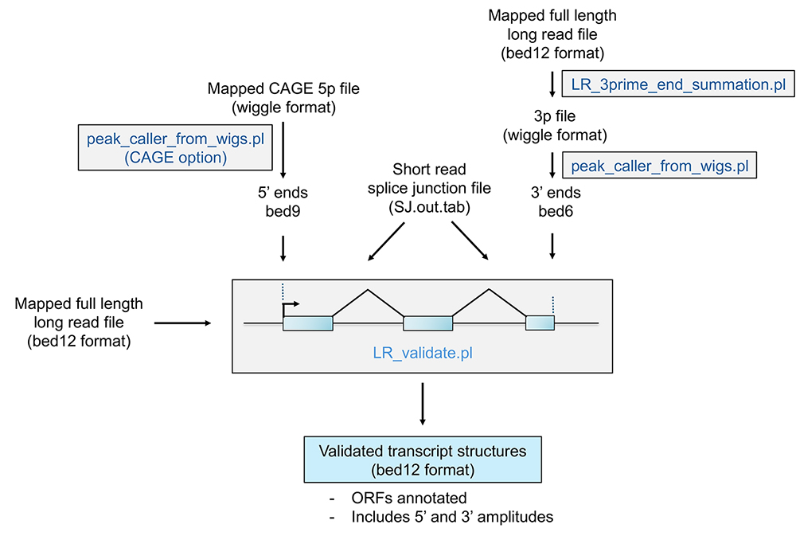

# LongReadAnnotation 


## Project Description
LongReadAnnotation is a tool for annotating and validating long reads from sequencing data. It includes pipelines for identifying start and end site clusters and validating the long reads.

## Citation

Erik K Flemington, Dinh Truong Nguyen

## Requirements
- Perl 5

## Dependencies
- File::Basename

## Installation
1. Clone the repository:
```sh
git clone https://github.com/flemingtonlab/LongReadAnnotation.git
```
2. Install the dependencies (ensure Perl and required modules are installed).


## File Formats

| File          | Description                                      |
|:--------------|:------------------------------------------------:|
| Wiggle        | Standard wiggle format                           |
| BED12         | Standard BED12 format                            |
| BED6          | Standard BED6 format                             |
| Genome fasta  | Standard genome fasta (can be wrapped or unwrapped) 

## LongReadAnnotation Pipeline
### 1. Identify Start Site Clusters
1. Call 5' peaks from wig files (use “-CAGE y” option which shifts output 1bp downstream for CAGE data because STAR aligner CAGE output option (—outWigType read1_5p) outputs signals 1bp upstream from start of read) :
   ```sh
   perl /PATH/peak_caller_from_wigs.pl -w PATH/MC1_Unique.str1.out_chr1.wig,PATH/MC2_Unique.str1.out_chr1.wig,PATH/MC4_Unique.str1.out_chr1.wig -mw 8 -fva 0.2 -mspd 10 -s + -CAGE y
   ```
2. Negative strand input wigs values must be negative! (If coverage values for negative strand wigs are positive, use invert_wigs.pl to change sign):
   ```sh
   perl /PATH/peak_caller_from_wigs.pl -w PATH/MC1_Unique.str2.out.negative_values_chr1.wig,PATH/MC2_Unique.str2.out.negative_values_chr1.wig,PATH/MC4_Unique.str2.out.negative_values_chr1.wig -mw 8 -fva 0.2 -mspd 10 -s - -CAGE y
   ```
3. Concatenate positive and negative strand bed files:
   ```sh
   cat /PATH/CAGE_peaks_positive_strand.bed /PATH/CAGE_peaks_negative_strand.bed > /PATH/CAGE_peaks_positive_plus_negative_strand.bed
   ```
4. Sort concatenated positive plus negative strand bed files (not essential but is a good configuration for the file)
   ```sh
   sort -V -k 1,1 -k 2,2n -k 3,3n /PATH/CAGE_peaks_positive_plus_negative_strand.bed > /PATH/CAGE_peaks_positive_plus_negative_strand_sorted.bed
   ```

### 2. Identify 3' Site Clusters
1. 3’ LR end summary (output is wiggle file coverage of 3’ end coverage):
   ```sh
   perl /PATH/LR_3prime_end_summation.pl -bed /PATH/LR.bed
   ```
2. Identify 3' end clusters:
   ```sh
   perl /PATH/peak_caller_from_wigs.pl -w PATH/MC1_3p_chr1.wig,PATH/MC2_3p_chr1.wig,PATH/MC4_3p_chr1.wig -mw 8 -fva 0.2 -mspd 10 -s +
   perl /PATH/peak_caller_from_wigs.pl -w PATH/MC1_3p_negative_values_chr1.wig,PATH/MC2_3p_negative_values_chr1.wig,PATH/MC4_3p_negative_values_chr1.wig -mw 8 -fva 0.2 -mspd 10 -s -
   ```
3. Concatenate positive and negative strand wig files
   ```sh
   cat /PATH/3p_peaks_positive_strand.bed /PATH/3p_peaks_negative_strand.bed > /PATH/3p_peaks_positive_plus_negative_strand.bed
   ```
 4. Sort concatenated positive plus negative strand wig files (not essential but is a good configuration for the file)
   ```sh  
   sort -V -k 1,1 -k 2,2n -k 3,3n /PATH/3p_peaks_positive_plus_negative_strand.bed > /PATH/3p_peaks_positive_plus_negative_strand_sorted.bed
   ```

### 3. Validate Long Reads
1. Long read validation:
   ```sh
   perl /PATH/LR_validate.pl -5Pp /PATH/MU_5P_CAGE_peaks_chr1.bed -mcde 10 -mcdi 2 -3Pp /PATH/MU_3P_peaks_chr1.bed -3Pde 10 -3Pdi 10 -minSJ 1 -SJt /PATH/MU-SJ.out.tab -f /PATH/hg38_chr1_first_portion.fa  -LR /PATH/MU_LR_fullLength.merged_1million.bed
   ```
2. Long read validation with previously identified ATG start sites enforcing ORF predictions:
   ```sh
   perl /PATH/LR_validate.pl -5Pp /PATH/MU_5P_CAGE_peaks_chr1.bed -mcde 10 -mcdi 2 -3Pp /PATH/MU_3P_peaks_chr1.bed -3Pde 10 -3Pdi 10 -minSJ 1 -SJt /PATH/MU-SJ.out.tab -f /PATH/hg38_chr1_first_portion.fa  -LR /PATH/MU_LR_fullLength.merged_1million.bed -ATG /PATH/LR_validate/test_data/hg38_chr1_known_ORF_start_sites.bed
   ```
